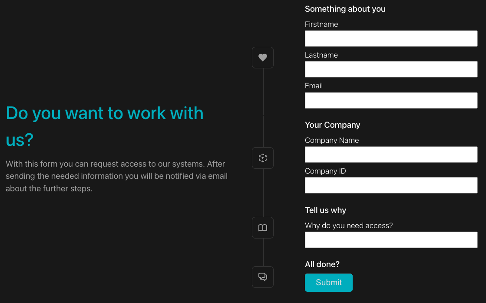
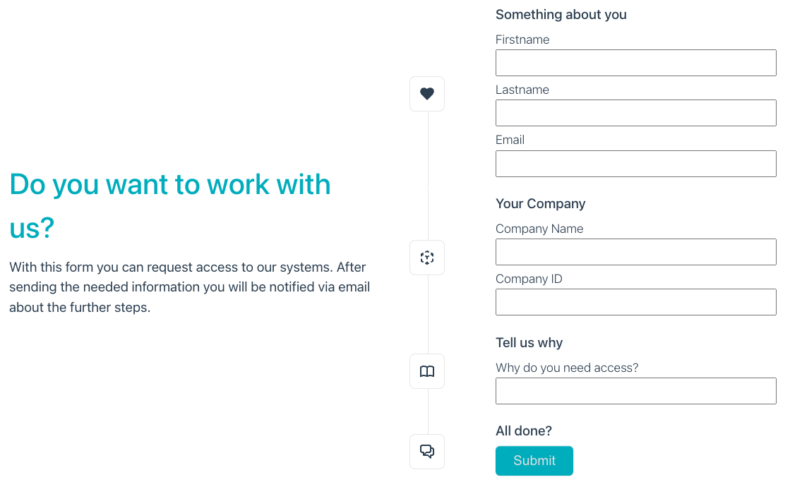
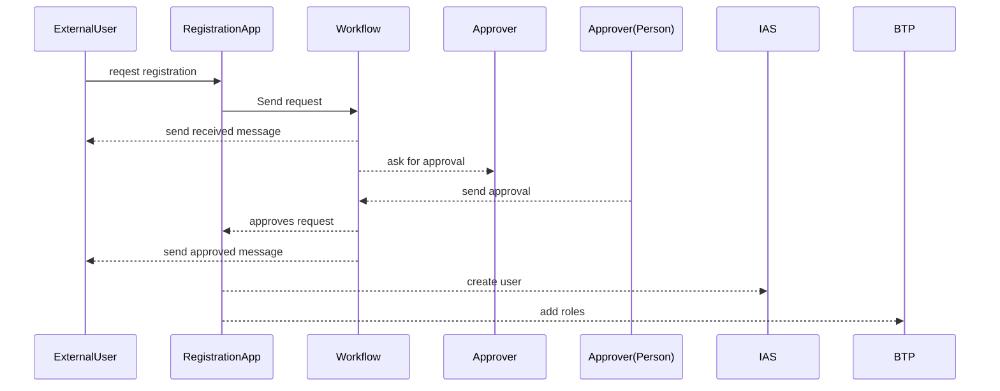
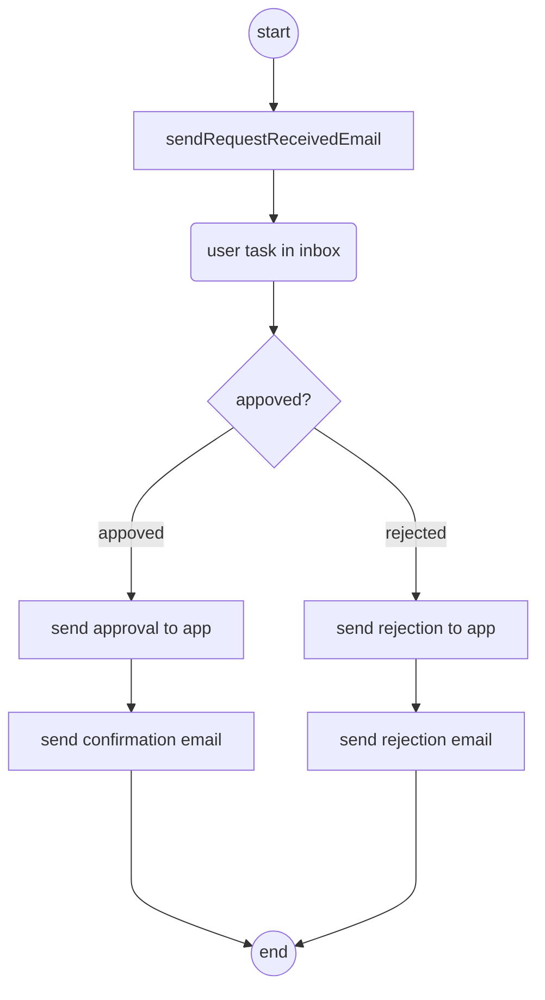

<!--
SPDX-FileCopyrightText: 2022 Martin Grasshoff https://github.com/mgrassho

SPDX-License-Identifier: Apache-2.0
-->
[](https://api.reuse.software/info/github.com/mgrassho/SAPBTP_ExtUserReg)

# SAP BTP External User Registration

Showcase on how to implement external user registration end to end

## Use case description

When a company wants to allow external persons access to internal systems, these external users need a system user to access the needed data or applications.

The following PoC shows a system setup, that allows an external user to self-register, allows internal processes and workflows to validate and approve/reject the registration request and eventually adds an new system user including the appropriate roles to the SAP BTP IAS and other related systems automatically.

Self-registration is limited to the scope of subaccount authentication for being a user on a BTP hosted applications. The external users will therefore not get accesss to the BTP cockpit on Global Account level.


The external user can access the registration form on a public URL and will be presented this form:



As the frontend is "dark/light" mode aware it adjusts automatically:



## Registration flow



## Components

* Custom app for registration, based on vue.js
* Cloud Application Programming Model (CAP)
* Custom App Router
* HANA Cloud DB, persistence
* Workflow Management
  * sending notificatione mails
  * form to display the registration request
* SAP IAS for user registration
* BTP API for user maagement (assignung roles)

## Objects

### Registrion request

The registration request is the object representing the data used to create a new external user. We will store all data in one table for the time being. The following attributes are needed:

|Field|Datatype|Mandatory|Description|
|---|---|:-:|---|
|RegID|UUID|X|System set UUID of this request|
|Salutation|String||Salutation of person registering|
|Firstname|String|X|Firstname of external user|
|Lastname|String|X|Lastname of external user|
|Company|String|X|Company Name|
|CompanyID|String|X|Internal ID of the company provided by the external user|
|Email|String|X|Email is used as a unique id for the user also in IAS|
|Phone|String||Phone number of person registering
|Reason|String| |Resoning for creating this request. Can also be seen as an additional field for short messages, which will be displayed to approver|
|RegistrationDate|Timestamp|X|System set date of resgistration reqest created|
|Status|String|X|Allowed values:<br> N = new (default),<br> R = rejected,<br> A = approved|
|DecisionDate|Datetime| |Date when request was approved/Rejectec|

Currently, not all attribues are being used in the frontend or the workflow. 

### Approval Workflow

After the registration request was submitted, a workflow will start to let a person decide whether the request will be approved or not. The workflow could determine who will be responsible for the approval, based on the CompanyID in the registration request, but this is not implemented yet. To do so, the CompanyID could be associated with the right approver. This data could be provided by the application itself, or can be maintained in a Business Rule. Either way, the frontend form triggers a user request and will put the request data into the inbox, where a person can approve or reject. After the decision has been made, the workflow calls the application and set the approval state and the application will then set the DecisionDate.

Approved status means that the request was approved and was submitted to IAS and BTP.

The workflow will be triggered by an unauthenticated user. Therefore, we need technical credentials. A link on how to enable technical authentication for workflows is listed below.



### SAP Identity and Authentication Service

The IAS is  used as an IdP. A few configuration steps needs to be done in order to use it.

* IAS tenant needs to enabled to be used for subaccount level authentication

It's recommended to create a technical user with the least priviledges on IAS and configure the IAS parameter in package.json.

### SAP BTP Management API

In order to perform administrative task on BTP account level, you need to access the available APIs on BTP. They are documented here [help.sap.com](https://help.sap.com/docs/BTP/65de2977205c403bbc107264b8eccf4b/1c8db1483d914cd99047aac5280f61ea.html?locale=en-US).

Manually, you can do it like this.

```bash
# Create apiaccess service instance
cf create-service xsuaa apiaccess apiaccess-customeroffice

# Create service key
cf create-service-key apiaccess-customeroffice apiaccess-key

# Retrieve Service key
cf service-key apiaccess-customeroffice  apiaccess-key

```

Anyhow, to automate the installation of this project, these steps where added to the mta.yaml:

```yaml
- name: ExtUserReg-service-apiaccess
  type: org.cloudfoundry.managed-service
  parameters:
    service: xsuaa
    service-name: ExtUserReg-workflow-apiaccess
    service-plan: apiaccess
```

No need to do this manually.

### Workflow-Management

The CAP application will call the Workflow-Management API to create a WF instance. Since the external user is still anonymous, we can't use principle propagation in this case. To allow technical user access to Workflow-Manaement API, the service instance needs to be configured with scopes to enable this. Therefore, we pass a config json during deployment to CF using the [wf-config.json](./wf-config.json). Here we define the needed scopes:

```json
{
    "authorities": [
        "WORKFLOW_INSTANCE_START",
        "MESSAGE_SEND",
        "WORKFLOW_INSTANCE_GET",
        "WORKFLOW_INSTANCES_UPDATE",
        "WORKFLOW_INSTANCE_CANCEL",
        "WORKFLOW_INSTANCE_GET_ERROR_MESSAGES",
        "WORKFLOW_INSTANCE_GET_CONTEXT",
        "WORKFLOW_INSTANCE_UPDATE_CONTEXT"
    ]
}
```

In the mta.yaml this is referenced here:

```yaml
- name: ExtUserReg-service-workflow
  type: org.cloudfoundry.managed-service
  parameters:
    path: ./wf-config.json
    service: workflow
    service-name: ExtUserReg-workflow
    service-plan: standard
```

### Approuter

This project makes use of unmanaged/custom Approuter provided by SAP [Link](https://www.npmjs.com/package/@sap/approuter). This is to enable public/anonymous access to the frontendapplication and the OData API to place a new registration quest to the database. Also, it hosts the vue-based registration form in its static files.

The vue form can be found in the frontend folder (/pages). The MTAR build will place the distribution files into the static folder of the approuter by use of a custom builder as follows:

```yaml
- name: FrontendBuilder
  type: html5
  path: frontend
  build-parameters:
    build-result: ../app/pages
    builder: custom
    commands:
    - npm run build
    supported-platforms: []
```

Noteworthy routes configuration in xs-app.json:

```json
{
  "welcomeFile": "/pages/",
  "authenticationMethod": "route",
  "routes": [ ]
}
```

First, we define where the frontend application is stored. The vue build will place the folders into the "/pages" folder. Where index.html will automatically be loaded. The authenticationMethod is "route" as each route needs to define its own way - remember, we have some public and some authenticated routes.

Let's take a look at the three defined routes:

```json
{
  "source": "^/service/ExtUserReg(.*)$",
  "target": "service/ExtUserReg$1",
  "destination": "ExtUserReg-app-srv",
  "authenticationType": "none"
},
{
  "source": "^/assets(.*)$",
  "target": "$1",
  "localDir": "pages/assets",
  "authenticationType": "none"
},
{
  "source": "^/pages/(.*)$",
  "target": "$1",
  "localDir": "pages",
  "authenticationType": "none"
}
```

The first route defines the access to the CAP API to allow the frontend to store the form data. It matches everything that ends with /services/ExtUserReg and defines a BTP Destination as the data source. Even though the Destination itself uses OAuth tokens to authenticate, we expose this route as "authenticationType":"none" as the route itself must be availably publicly. The approuter will take care of getting the right auth token for the destination as it is bound (cf bind service via mta.yaml) to the uaa and destination service.
The other two routes will make sure our frontend application is accessible in the directories /pages and /pages/assets. Since both needs to be public allwoing anonymous access, they are defined with authenticationType "none".

Full configuration can be found here:
[xs-app.json](./app/xs-app.json)

### Frontend Form

The frontend application is not using the SAP Fiori desgin language for two reasons:

* The page is not intended to be used by employees, but external users. It is a B2B scenario where different audience is addressed. Anyhow, there is nothing speaking against using SAP Firoi Design language in this case as well.
* This is a showcase of BTP as an open technology platform to demonstrate how easy it can be used with best fitting technologies for any use case.

In this case we are using Vue.js [Link](https://vue.js) as the application framework to build our registration form. Additionally, we use Typescript in this project.

The project was generated (initial project creation) into the /frontend folder and the distribution files will be copied into the /app/pages folder of the approuter.

This behavior is defined in the vite.config.ts, where we also had to define some other important configurations:

* base:

   This tells vue that the application is NOT located in / folder, but in /pages at runtime. This is important for the internal router.
* outDir:

   The directory to put the distribution files

* isCustomElement:

   Only needed when we use Webcomponents, such as UI5 Webcomponents.

Adding web component config to vite is only needed if you intent to use Webcomponents such as UI5 Webcomponents.

```typescript

const outDir = "../app/pages";
const baseURL = "/pages/";

export default defineConfig({
  base: baseURL,
  plugins: [vue(
    {
      template: {
        compilerOptions: {
          // 1. Tell Vite that all components starting with "ui5-" are webcomponents
          isCustomElement: (tag) => tag.startsWith('ui5-')
        }
      }
    }
  )
  ],
  resolve: {
    alias: {
      "@": fileURLToPath(new URL("./src", import.meta.url)),
    },
  },
  build: {
    outDir: outDir,
    minify: false,
  },
});
```

## Installation and configuration

To install and run this project you need to:

* Make sure you have the right entitlements for the needed resources, such as Workflow-Management, CF runtime and the like.
* Clone the project into your dev environment
* Run

   ```bash
   npm update
   ```

* Provide config parameters in package.json:

   ```json
  "appconfig": {
      "ORIGIN": "httpsa45a99413.accounts400.ondemand.",
      "IASService": "https://a45a99413.accounts400.ondemand.com",
      "IASUser": "TECHNICAL IAS USERNAME",
      "IASPasswd": "PASSWD",
      "defaultRole": "Business_Application_Studio_Developer",
      "initialPasswd": "Initial1234!",
      "WFDefinitionID": "externaluserrequest"
  }
  ```

|Field|Description|
|---|---|
|ORIGIN| IAS origin value - the name of the custom IdP|
|IASService| API root location of IAS tennant|
|IASUser|Username of technical user|
|IASPasswd|Password of technical user|
|defaultRole|technical CF role name.Currently, there is only one role assignement possible|
|initialPasswd|This is the password the external user will receive|
|WFDefinitionID|The id of the workflow definition to be invoked|

Full config can be found here: [package.json](./package.json)

## Potential Improvement Areas

* Currently, only one role will be assigned upon registration. Could be updated to allow list of roles
* Missing integration test
* Add a build pipeline
* Workflow can be adjusted for using Business Rules to add more sophisticated process
* Frontend can be improved with error handling
* Operational excellence needs to be added for production (e.g. alerting, monitoring)
* Workflow email templates could be improved. Short plain text at the moment.

## Useful Tips & Tricks

### General

Sometimes you want to uninstall the project. Anyhow, not all services will be deleted, and manually some services/service key/bindings needs to be removed if you just use "cf undeploy". In order to complety uninstall all related services and keys you can use this command:

```bash
  cf undeploy ExtUserReg --delete-service-keys --delete-services
```

Build using mbt tool

```bash
  mbt build
````

Deploy using CF

```bash
  cf deploy mta_archives/ExtUserReg_1.0.0.mtar 
```

Run frontend locally, switch to /frontend dir and:

```bash
npm run dev
```

### Debugging

The CAP-based ExtUserReg-srv is set to debug via service.js:

```javascript
cds.env["log-level"] = 'debug';
console.debug("DEBUG MODE STARTED");
```
This should be disabled for production.

You can check the logs for the CAP application using:

```bash
cf logs ExtUserReg-srv
```

Logs for Approuter can be retrieved using:

```bash
cf logs ExtUserReg
```

Also, debugging of Approuter is enabled in mta.yaml. For production, you should set

```yaml
  XS_APP_LOG_LEVEL: info
```

### Partial build and deployment

Since the frontend needs to deployed often to be tested it can be benefitial to build only the frontend and deploy it without going to deploy the full mtar. You can do so by:

```bash
  mbt module-build -m=ExtUserReg -g
```

to build just the frontend. Afterwards you can deploy to your CF subaccount by:

```bash
cf deploy -m ExtUserReg
```

Module build took ~6 seconds, while the full build is around 22 seconds.
The full mtar deployment can take several minutes (~3min), while the frontend module only took around 1 min and 30 seconds.

### Temp config values / Links

* Remote CAP debugging: [Link](https://blogs.sap.com/2021/06/11/set-up-remote-debugging-to-diagnose-cap-applications-node.js-stack-at-runtime-running-on-sap-btp-cloud-foundry-environment/)
* IAS Enable API: [Link](https://help.sap.com/docs/IDENTITY_AUTHENTICATION/6d6d63354d1242d185ab4830fc04feb1/5c3c35e01e3c4e7e8dd72af60c997c5d.html?locale=en-US)

* Establish trust with IAS for platform users [Link](https://help.sap.com/docs/BTP/65de2977205c403bbc107264b8eccf4b/c36898473d704e07a33268c9f9d29515.html?locale=en-US)

* IAS Identitiy Directory Service [Link](https://blogs.sap.com/2022/02/01/sap-cloud-identity-services-identity-directory/)

* Establish trust with IAS on subaccount level [Link](https://help.sap.com/docs/BTP/65de2977205c403bbc107264b8eccf4b/9dba751c208f4435a711c26b20945980.html)

* Enable API Access for XSUAA: [Link](https://help.sap.com/docs/BTP/65de2977205c403bbc107264b8eccf4b/ebc9113a520e495ea5fb759b9a7929f2.html)

* Github Link to valuable Workflow tutorial [Link](https://github.com/SAP-archive/cloud-platform-workflow-virtual-event)

* Enable technical user for Workflow Management [Link](https://help.sap.com/docs/WORKFLOW/e157c391253b4ecd93647bf232d18a83/c74f5ff9065b4baeb700d033602ef1d9.html?locale=en-US)

* Very useful REST Workflow Guide/Blog [Link](https://blogs.sap.com/2021/02/24/exploring-btp-workflow-service-apis-with-a-sample-application/)

* Very good blog about SAP Application Router [Link](https://blogs.sap.com/2020/04/03/sap-application-router/)

## License

Copyright (c) 2021 Martin Grasshoff. All rights reserved. This project is licensed under the Apache Software License, version 2.0 except as noted otherwise in the [LICENSE](LICENSES/Apache-2.0.txt) file.
